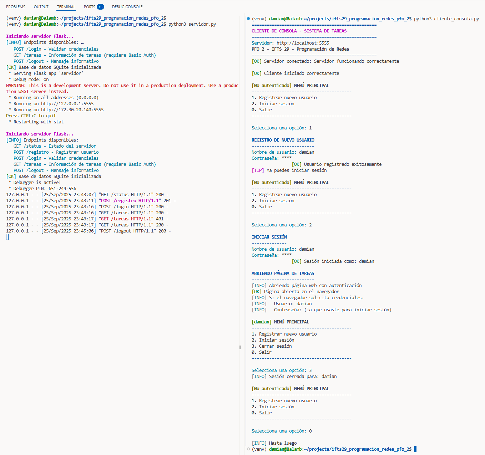
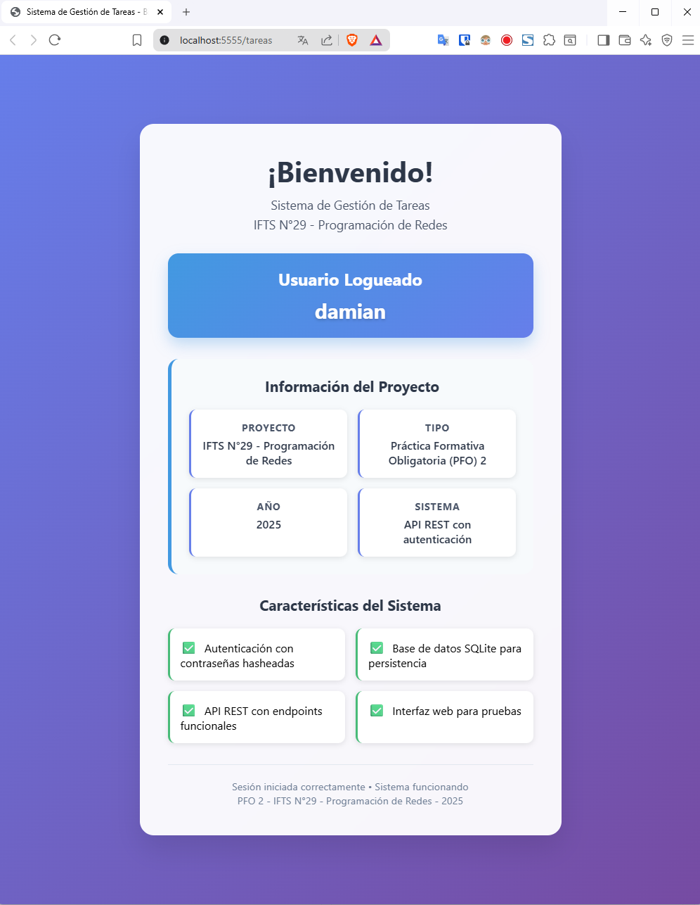

# IFTS 29 - Tecnicatura en Desarrollo de Software
## Programación sobre redes - 3° D

### Práctica Formativa Obligatoria 2
**Sistema de Gestión de Tareas con API REST y SQLite**

**Alumno:** Damián Andrés Clausi  
**Profesor:** Germán Ríos

**Fecha de entrega:** 28/09/2025 

## Inicio Rápido

```bash
# Prueba completa del sistema
./test.sh
```

El script `test.sh` es completamente autodocumentado y maneja todo automáticamente.

## Más Opciones

```bash
```bash
./test.sh --help    # Guía completa
./test.sh --demo    # Solo demostración  
./test.sh --client  # Cliente interactivo
```

**No necesitas leer más documentación - el script te explica todo durante la ejecución.**

## Requisitos del Sistema

Este proyecto está **diseñado específicamente para WSL** y aprovecha:
- ✅ **WSL (Windows Subsystem for Linux)**: Entorno de ejecución principal
- ✅ **Integración Windows-Linux**: Apertura automática de navegadores Windows desde WSL
- ✅ **Python 3.8+**: Con soporte para entornos virtuales
- ✅ **Terminal con colores**: Para la mejor experiencia visual

**Nota**: El cliente de consola está optimizado para WSL y utiliza `cmd.exe` y `wslpath` para la integración con Windows.
```
---

## Descripción del Proyecto Original

Este proyecto implementa un sistema de gestión de tareas con una API REST desarrollada en Flask, que incluye autenticación de usuarios y persistencia de datos en SQLite. El sistema permite registrar usuarios, iniciar sesión y acceder a una página de bienvenida protegida.

## Objetivos Cumplidos

1. ✅ **API REST con endpoints funcionales**
2. ✅ **Autenticación básica con protección de contraseñas**  
3. ✅ **Gestión de datos persistentes con SQLite**
4. ✅ **Cliente interactivo de consola** (cliente_consola.py)

## Tecnologías Utilizadas

- **Flask 2.3.3** - Framework web para Python
- **SQLite** - Base de datos ligera para persistencia
- **bcrypt 4.0.1** - Librería para hasheo seguro de contraseñas

## Estructura del Proyecto

```text
ifts29_programacion_redes_pfo_2/
├── servidor.py                   # Servidor Flask con API REST
├── cliente_consola.py            # Cliente interactivo de consola  
├── test.sh                       # Script unificado de pruebas
├── requirements.txt              # Dependencias del proyecto
├── README.md                     # Documentación del proyecto
├── tareas_bienvenida.html        # Página HTML de bienvenida
├── screenshots/                  # Capturas de pantalla del sistema
│   ├── consola.png              # Cliente de consola funcionando
│   └── pagina_bienvenida.png    # Página web de tareas
└── tareas.db                     # Base de datos SQLite (se crea automáticamente)
```

### Archivos principales:
- **`servidor.py`** - API REST con Flask, SQLite y autenticación HTTP Basic
- **`cliente_consola.py`** - Cliente interactivo optimizado para WSL
- **`test.sh`** - Script autodocumentado para pruebas completas del sistema
- **`tareas_bienvenida.html`** - Página web dinámica con información del usuario
- **`screenshots/`** - Capturas demostrando el funcionamiento del sistema

## Instalación y Configuración

### Opción 1: Instalación Automática (RECOMENDADO)
```bash
chmod +x test.sh
./test.sh
```

### Opción 2: Instalación Manual

#### Paso 1: Crear Entorno Virtual
```bash
python3 -m venv venv                # Crear entorno virtual
source venv/bin/activate            # Activar entorno virtual
```

**Verificar que está activado:**
```bash
which python3                       # Debe mostrar: .../venv/bin/python3
pip list                           # Debe mostrar pocas librerías (entorno limpio)
```

#### Paso 2: Instalar Dependencias
```bash
pip install -r requirements.txt
```

#### Paso 3: Ejecutar el Servidor
```bash
python servidor.py                  # Con entorno activado
```

#### Paso 4: Ejecutar el Cliente (en otra consola)
```bash
source venv/bin/activate            # Activar en la nueva consola
python cliente_consola.py
```

## **Consejos del Entorno Virtual**

### **¿Cómo sé si está activado?**
Cuando el entorno virtual está activo verás:
```bash
(venv) usuario@wsl:~/proyecto$      # ← El prefijo (venv)
```

### **¿Cómo desactivar?**
```bash
deactivate                          # Salir del entorno virtual
```

### **¿Cómo reactivar?**
```bash
source venv/bin/activate            # Desde la carpeta del proyecto
```

## Endpoints de la API

### 1. Registro de Usuarios
- **Endpoint:** `POST /registro`
- **Formato:** `{"usuario": "nombre", "contraseña": "1234"}`
- **Descripción:** Almacena usuarios en SQLite con contraseñas hasheadas

**Ejemplo:**
```bash
curl -X POST http://localhost:5555/registro \
  -H "Content-Type: application/json" \
  -d '{"usuario": "test_user", "contraseña": "1234"}'
```

### 2. Inicio de Sesión
- **Endpoint:** `POST /login`
- **Formato:** `{"usuario": "nombre", "contraseña": "1234"}`
- **Descripción:** Verifica credenciales y permite acceso a las tareas

**Ejemplo:**
```bash
curl -X POST http://localhost:5555/login \
  -H "Content-Type: application/json" \
  -d '{"usuario": "test_user", "contraseña": "1234"}'
```

### 3. Gestión de Tareas
- **Endpoint:** `GET /tareas`
- **Descripción:** Muestra un HTML de bienvenida (requiere autenticación HTTP Basic)

**Ejemplo:**
```bash
curl -u test_user:1234 -X GET http://localhost:5555/tareas
```

### 4. Estado del Servidor
- **Endpoint:** `GET /status`
- **Descripción:** Verifica que el servidor esté funcionando

**Ejemplo:**
```bash
curl -X GET http://localhost:5555/status
```

## Cliente Interactivo para WSL

El proyecto incluye un cliente de consola optimizado para WSL:

```bash
./cliente_consola.py
```

El cliente permite:
- ✅ Registro de nuevos usuarios
- ✅ Inicio de sesión con credenciales  
- ✅ Acceso a la página de tareas
- ✅ Interfaz colorizada y amigable
- ✅ Enmascaramiento de contraseñas
- ✅ **Apertura automática en navegador Windows desde WSL**
- ✅ **Integración WSL-Windows con `wslpath` y `cmd.exe`**

## Capturas de Pantalla

### 1. Cliente de Consola Interactivo


*Cliente de consola mostrando la interfaz colorizada, registro de usuario e inicio de sesión con apertura automática del navegador desde WSL*

### 2. Página de Bienvenida de Tareas


*Página HTML de bienvenida generada dinámicamente con autenticación HTTP Basic, mostrando información del proyecto y del usuario autenticado*


## Respuestas Conceptuales

### ¿Por qué hashear contraseñas?

El hasheo de contraseñas es fundamental por las siguientes razones:

1. **Seguridad de datos:** Incluso si la base de datos es comprometida, las contraseñas reales permanecen ocultas
2. **Irreversibilidad:** Los algoritmos de hash son unidireccionales, imposibilitando la recuperación de la contraseña original
3. **Protección contra administradores:** Ni siquiera los desarrolladores pueden ver las contraseñas reales

### Ventajas de usar SQLite en este proyecto

SQLite ofrece múltiples ventajas para este tipo de proyectos:

1. **Simplicidad:** No requiere servidor de base de datos separado, funciona como archivo local
2. **Cero configuración:** Se integra directamente con Python sin instalaciones adicionales
3. **Portabilidad:** El archivo .db puede moverse entre sistemas sin problemas
4. **Rendimiento:** Excelente para aplicaciones pequeñas y medianas con acceso local
5. **Estándar SQL:** Utiliza SQL estándar, facilitando futuras migraciones
7. **Ligero:** Ocupa muy poco espacio en disco y memoria
8. **Confiabilidad:** Ampliamente probado y utilizado en millones de aplicaciones

---
